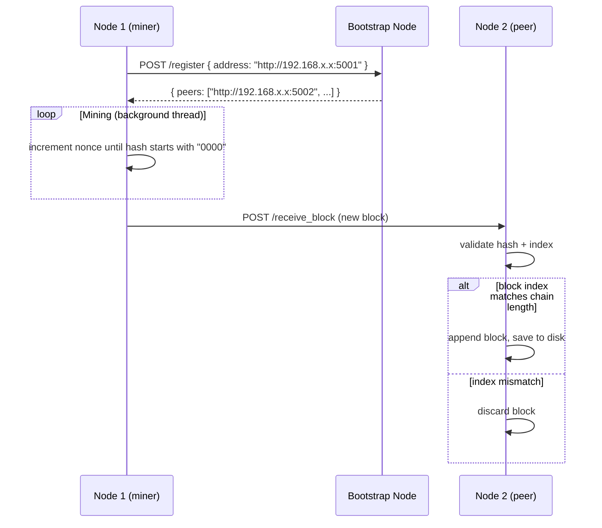

# Blockchain_Pow

A distributed proof-of-work blockchain running across multiple real networked nodes. Each node mines independently, broadcasts discovered blocks to peers, and converges on the longest valid chain. Built to understand the mechanics of distributed consensus without the abstraction of a library.

---

## Why build this

Most blockchain tutorials run a single process that fakes decentralization. This one runs genuine concurrent nodes on separate machines (or ports) that communicate over HTTP — discovering each other, racing to mine the next block, and resolving forks by comparing chain length. The goal was to implement the core loop of Bitcoin's architecture in its simplest reproducible form.

---

## Architecture

### Node roles

The first node started acts as the **bootstrap node**. Every subsequent node registers itself with the bootstrap node on startup, receiving the current peer list in return. After that, all communication is peer-to-peer — the bootstrap node has no special authority.

### Block structure

```python
{
  "index":        int,       # height in the chain
  "transactions": list,      # pending txns included at mining time
  "previous_hash": str,      # SHA-256 of the previous block
  "miner":        str,       # LAN IP:port of the miner
  "timestamp":    float,     # Unix epoch
  "nonce":        int,       # incremented until hash condition is met
  "hash":         str        # SHA-256 of the block fields
}
```

### Mining loop

A background thread continuously increments a nonce until the block's SHA-256 hash starts with `0000` (difficulty = 4 leading zeros). On success, the block is appended to the local chain and broadcast to all known peers via `POST /receive_block`.

### Peer discovery

On startup each node sends `POST /register` to the bootstrap node, which returns the current list of active miners. Nodes run a periodic health check every 15 seconds — any peer that fails `/health` is dropped from the active set. Miners that haven't been seen in 30 seconds are also removed from the active list.

### Fork resolution

When a node receives a block from a peer, it validates the block hash and checks whether the incoming block index matches the expected next block. If it does, the block is appended. The longest-chain rule applies implicitly — nodes that fall behind will receive future blocks at higher indices and sync from peers.

### Persistence

Each node writes its chain and miner list to JSON files in `blockchain_data/`. Restarting a node re-reads from disk rather than starting from genesis.

---

## Flow diagram



---

## Tech stack

| Technology | Role |
|------------|------|
| **Python 3** | Core runtime — straightforward threading and HTTP primitives |
| **Flask** | HTTP server for each node — exposes the API and serves the web UI |
| **requests** | Peer-to-peer HTTP calls — registration, block broadcast, health checks |
| **threading** | Concurrent mining loop and peer-sync loop without blocking the Flask server |
| **JSON files** | Chain persistence across restarts without a database dependency |

---

## How to run (multi-node simulation)

### Prerequisites

```bash
pip install flask requests
```

### Start the bootstrap node (Node 1)

```bash
PORT=5000 python node.py
```

The first node started becomes the bootstrap. Open the web UI at `http://localhost:5000`.

### Start additional nodes (same machine)

Open two more terminals:

```bash
PORT=5001 BOOTSTRAP_NODE=http://localhost:5000 python node.py
PORT=5002 BOOTSTRAP_NODE=http://localhost:5000 python node.py
```

### Start nodes on separate LAN machines

On Machine A (bootstrap):
```bash
PORT=5000 python node.py
```

On Machine B:
```bash
PORT=5000 BOOTSTRAP_NODE=http://192.168.x.x:5000 python node.py
```

Replace `192.168.x.x` with Machine A's LAN IP. Each node detects its own LAN IP automatically and registers it with the bootstrap — so peers will reach it via LAN address, not `localhost`.

> **Note:** The env var is `BOOTSTRAP_NODE`, not `BOOTSTRAP`.

### Observe mining

- The web UI auto-refreshes every 3 seconds
- **Active Miners** panel shows all live nodes
- **Blockchain** panel shows the current chain with block index, miner IP, hash, and included transactions
- Use the **New Transaction** form to submit a transaction — it enters the pending pool and gets included in the next mined block

---

## API reference

| Method | Endpoint | Description |
|--------|----------|-------------|
| `POST` | `/transactions/new` | Submit a transaction `{ sender, receiver, amount }` |
| `GET` | `/chain` | Return the full chain as JSON |
| `GET` | `/miners` | List currently active peer nodes |
| `POST` | `/register` | Register a new node; returns current peer list |
| `POST` | `/receive_block` | Accept a block broadcast from a peer |
| `GET` | `/health` | Liveness check — returns 200 if node is up |

---

## Scope and honest limitations

This implements the core distributed consensus loop: independent nodes mine, broadcast, and converge via the longest-chain rule. It is not a production blockchain.

What's missing compared to a real chain:
- **No transaction signing** — any node can submit a transaction claiming to be anyone
- **No UTXO or balance tracking** — amounts are recorded but never validated
- **No Merkle tree** — transactions are hashed as a flat list, not a tree
- **Fixed difficulty** — real chains adjust difficulty every N blocks based on observed hash rate
- **HTTP transport** — a production P2P network uses a purpose-built protocol (libp2p, devp2p) not Flask routes
- **No mempool prioritization** — all pending transactions are included regardless of fee
- **Bootstrap node is a single point of failure** — DNS seeding or a hardcoded peer list would remove this dependency

The implementation is intentionally minimal. The value is in seeing the consensus loop work end-to-end across real concurrent processes, not in production-readiness.
